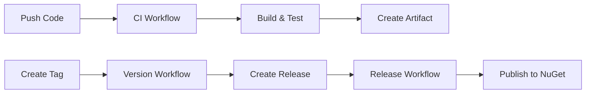

# 🚀 Quick Release Guide

## Creating a New Release

### Option 1: GitHub UI (Easiest)
1. Go to **Actions** tab
2. Select **"Version and Tag"** workflow
3. Click **"Run workflow"** button
4. Fill in:
   - Version: `1.0.0` (or `1.0.0-beta.1` for prerelease)
   - Is prerelease: Check if beta/alpha/rc
5. Click **"Run workflow"**
6. ✅ Done! Package will be built, tested, and published automatically

### Option 2: Command Line
```bash
# Create and push a version tag
git tag -a v1.0.0 -m "Release version 1.0.0"
git push origin v1.0.0

# Create GitHub Release (triggers publishing)
gh release create v1.0.0 --title "v1.0.0" --notes "Release notes"
```

### Option 3: Using Make (if you add it)
```bash
# Add to Makefile:
# release:
# 	@read -p "Enter version (e.g., 1.0.0): " version; \
# 	git tag -a "v$$version" -m "Release version $$version"; \
# 	git push origin "v$$version"; \
# 	gh release create "v$$version" --generate-notes

make release
```

## Version Format

```
MAJOR.MINOR.PATCH[-PRERELEASE]

Examples:
  1.0.0           ← Stable release
  1.2.3           ← Updates
  2.0.0-beta.1    ← Beta (prerelease)
  1.5.0-alpha     ← Alpha (prerelease)
  1.0.0-rc.1      ← Release candidate
```

## When to Bump Version?

| Change Type | Version Bump | Example |
|------------|--------------|---------|
| 🔴 Breaking API change | Major | `1.0.0` → `2.0.0` |
| 🟢 New feature (compatible) | Minor | `1.0.0` → `1.1.0` |
| 🔵 Bug fix | Patch | `1.0.0` → `1.0.1` |
| 🟡 Prerelease | Add suffix | `1.0.0-beta.1` |

## Workflow Summary



1. **Push code** → CI runs, creates test package
2. **Create version tag** → Release workflow publishes to NuGet.org
3. **Package available** → Users can install via `dotnet add package`

## Required Setup

### First Time Only:
1. **Get NuGet API Key**
   - Go to https://www.nuget.org/account/apikeys
   - Create new key with "Push" permission
   
2. **Add to GitHub Secrets**
   - Repository → Settings → Secrets and variables → Actions
   - New secret: `NUGET_API_KEY` = (your key)

### That's it! 🎉

## Troubleshooting

**"Version already exists"**
→ Increment version number (can't overwrite on NuGet.org)

**"Tag already exists"**
```bash
git tag -d v1.0.0              # Delete local
git push origin :refs/tags/v1.0.0  # Delete remote
```

**"Workflow failed"**
→ Check Actions tab for logs, ensure all tests pass

## Help

- Full docs: `.github/VERSIONING.md`
- Workflows: `.github/workflows/`
- Questions: Open an issue
